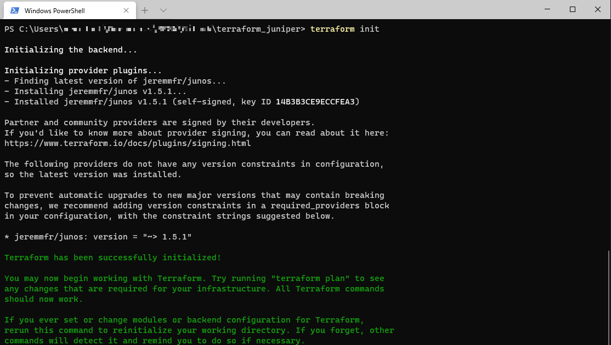
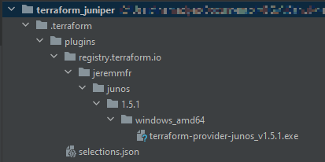
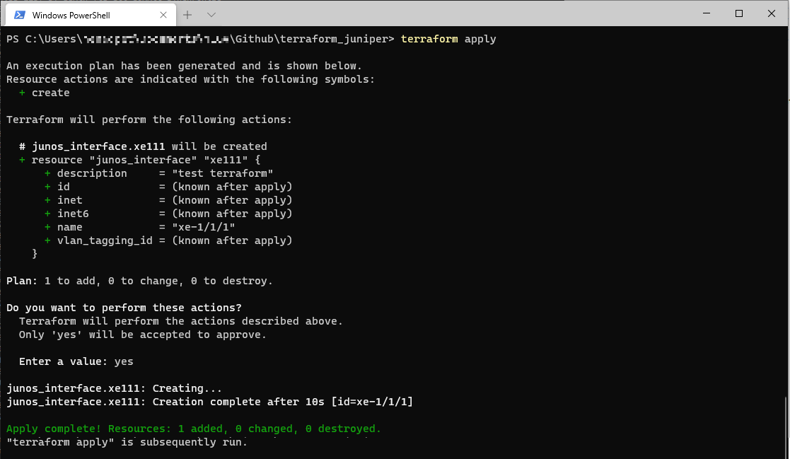

# Demo of the Terraform Junos Provider
Brief demonstration of a custom provider to configure Juniper Networks devices.

## Getting Started
### Installation
The Junos provider can be installed automatically with terraform >= 0.13.
```shell
terraform {
  required_providers {
    junos = {
      source = "jeremmfr/junos"
    }
  }
}
```
Having terraform intiated by calling terraform init   


the source files get compiled and downloaded to the following data structure in the plugins directory 


### Create Resources
As a sort of hello world example the interface xe-1/1/1 has been modified on a MX960 router.



## Example
The interface xe-1/1/1 is created by terraform.
```shell
admin@ROUTER> show configuration interfaces xe-1/1/1
description "test terraform";
```
As a prove of getting this done through terraform see the comments from the system commit history
```shell
admin@ROUTER> show system commit
0   2020-10-07 14:34:08 EEST by admin via netconf commit synchronize
    create resource junos_interface
1   2020-10-07 14:33:52 EEST by admin via cli commit synchronize
2   2020-09-24 12:39:50 EEST by admin via cli commit synchronize
3   2020-09-24 12:37:57 EEST by admin via cli commit synchronize
4   2020-09-24 12:34:50 EEST by admin via cli commit synchronize
```

## Documentation
More information on how to declare resources in HCL for Junos can be found at  
https://terraform-provider-junos.jeremm.fr/docs/providers/junos/index.html
